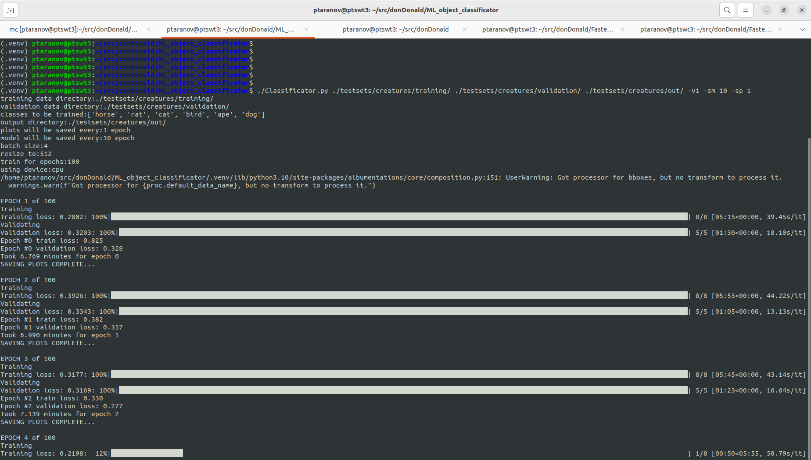
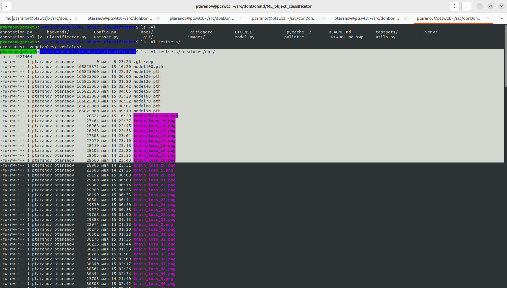
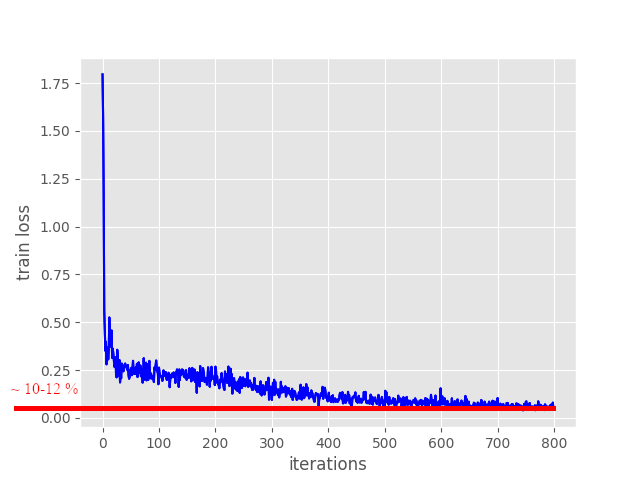
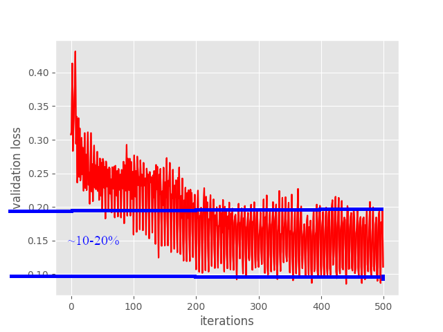
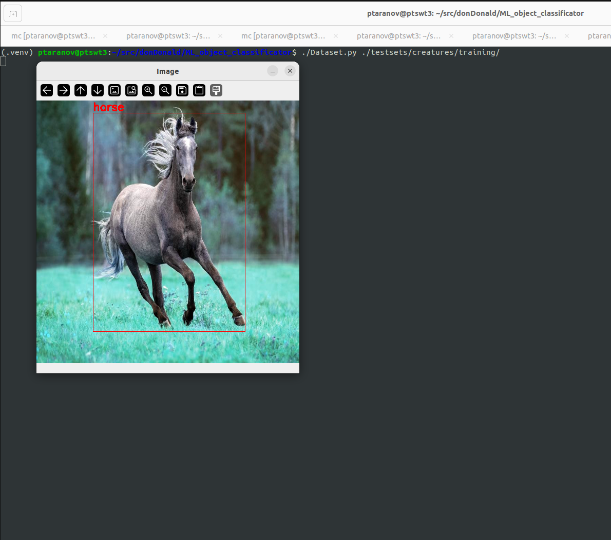

# Intro
It's an example of object classificator made on top of [PyTorch](https://pytorch.org/) and [Faster-RCNN](https://www.geeksforgeeks.org/faster-r-cnn-ml/) for training custom classification model.\
Usefull for the cases if here is need to detect some classes which are not covered by existing models.


# Setup 
Assume that ***python*** and ***pip3*** are installed by now.

## 1-st create local python environment
```
python3 -m venv .venv \
 && source .venv/bin/activate
```
Starting now on, assume that any py code is run for that newly created python environment, i.e. ***source .venv/bin/activate*** as called.


## 2-nd install all mandatory python packages
```
pip install torch torchvision --extra-index-url https://download.pytorch.org/whl/cpu \
 && pip install opencv-python \
 && pip install opencv-contrib-python \
 && pip install albumentations tqdm matplotlib
```


# Training classificator
Current solution has some testsets for testing how it works:
* testsets/creatures
* testsets/vegetables
* testsets/vehicles
Every testset has few labels, classes to be trained to predict.


***Classificator.py*** tool privided for training classification.\
To train a model against ***creatures*** testset:
```
./Classificator.py ./testsets/creatures/training/ ./testsets/creatures/validation/ ./testsets/creatures/out/ -v1 -sm 10 -sp 1
```

For more details:
```
./Classificator --help
```


---
The training will start in 100 epocs, default value.
<p align="center"></p>


---
As result of traiing process Classificator will write trained models and progres charts into testset out directory
<p align="center"></p>


---
***Train lossing*** is going down to ***~0.1 to ~.12***, i.e ***~10% to ~12%***
<p align="center"></p>


---
***Validation lossing*** is fluttering between ******
<p align="center"></p>


# Visualizing a dataset
***Dataset.py*** tool privided for visualizing datasets.\
To visualize ***./testsets/creatures/training/*** data set:
```
./Dataset.py ./testsets/creatures/training/
```

For more details:
```
./Dataset.py --help
```

<p align="center"></p>


# Referenses
* https://debuggercafe.com/custom-object-detection-using-pytorch-faster-rcnn/
* https://pyimagesearch.com/2018/11/12/yolo-object-detection-with-opencv/
* https://www.geeksforgeeks.org/faster-r-cnn-ml/
* [OBJECT_DETECTION_YOLO_VS_FASTER_R-CNN.pdf](docs/OBJECT_DETECTION_YOLO_VS_FASTER_R-CNN.pdf)

